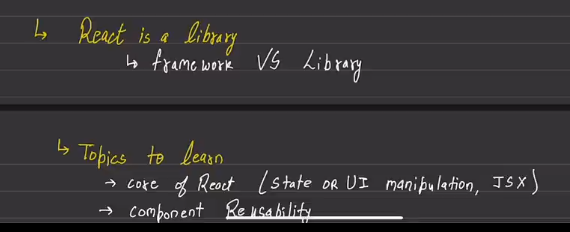
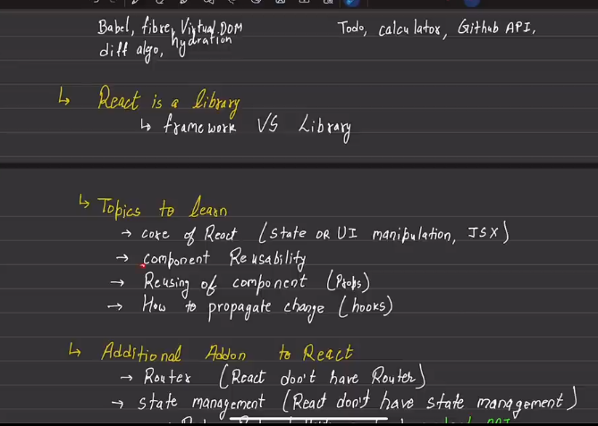
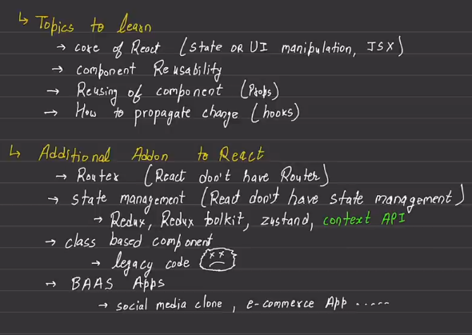
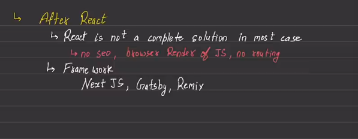

why to learn React?
it is easy to manage and bulid complex front-end.

 ***npx create-react-app 01basicreact***
 cd 01basicreact
 npm run start
 npm run build

Backend as  a service (BAAP)

// onclick demands a function to get passed to it.
// setcolor is a function, but setcolor() is not a function it is a returned value passed to the onclick